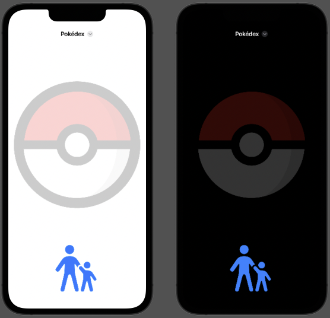
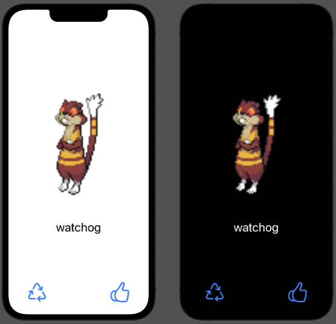
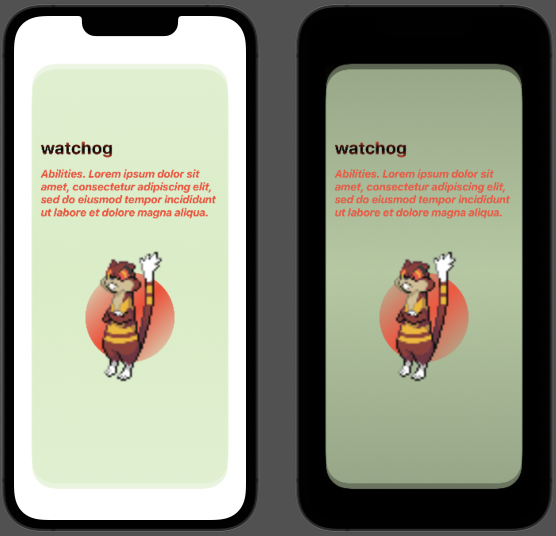

# iOS Swift assignment mini-Pokédex

# Organisering

- mpokedexApp.swift gjør så lite som mulig og delegerer over til MainView.
- MainView.swift peker videre på kids/KidsView og parents/ParentsView. J
- model/ er for eget domeneobjekt. 

Se kommentarer i toppen på swift-filene

## Features
- Startskjerm, voksen må først velge en Pokemon før barn kan trykke på Pokeball.

- Voksen kan velge pokemon, eller trykke random.

- Valgt pokemon lagres i UserDefaults
- Barneview har et card for å se valgt pokemon

- Pokemon-lista hentes og lagres i lokal database. Navneliste pr nå, men er laget for å utvides slik at en kan ta vare på mere data om pokemons. 
-- Enten up-front lasting. Dyr oppstart.
-- eller lagre hver gang en henter en pokemon vi ikke har sett før. Billigere oppstart, men laggy bilder som må hentes asynkront.

## PokemonAPI lib
Pokeapi.co sitt API er høyt denormalisert. Dataene om pokemons peker ofte videre til ressurser i stedet for å ha de på stedet, så det var mye tid å spare på å gå for PokemonApi libbet. GraphQL har jeg ikke nok erfaring med til å ta inn i en oppgave som denne.

## Bra
#preview nesten alltid fungert i alle view-ene. Jeg synes dette er noe av det viktigste å holde oppe for god produktivitet i UI-flikk.

AsyncImage er noe uberegnelig i #preview, og bør nok byttes ut med noe offline for previews.

## Problemer
Swift Testing har jeg ikke fått opp og gå som jeg ønsket. Det er noe i XCode 16.4 som gjør at jeg ikke får opp test-diamantene i gutter for å kunne kjøre indivduelle tester. Men CTRL-U fungerer og jeg fant et triks (.endabled -kriterie) for å kjøre kun én og én test.

MainView.swift er litt feit.

kids/PokemonCard er stygg :'(

## Bugs
modelContext skal ikke sendes til PokemonDataLoader, en får warnings på dette.

## Random greier
- Har AppIkon
- Har definert en farge og et bilde i Assets.

# Assignment COPY & PASTE FRA MAIL

## Build a mini Pokédex

### Background
Recently we received a request from a family whose kids love to play Pokémon GO. The parents
are interested in a good app where they can show their kids a new Pokémon daily.

### For the Parents
The parents want to be able to visit the app and see at least one randomly chosen new Pokémon.
This Pokémon should change each time they visit the page. The kids can choose one Pokémon
for their parents to show them, and the page will display details of that Pokémon for the parents
to read. If the kids are not interested in the Pokémon shown, the parent wants to be able to select
a new random match. The parents also want to bookmark certain Pokémon to revisit later.

### For the Kids
The kids are very curious! They want to see the image, name, possible evolutions, and
requirements for evolution in a kid-friendly, colorful UI. If the kids collect a Pokémon in Pokémon
GO that they have never seen before, they want to learn more about that Pokémon. The kids are
not always good at spelling and might be unhappy if their search returned no results! A mini
library that lists Pokémon by name or relevant search keywords would be super helpful.

### Tech Requirements
PokéAPI has a great connection with the Pokémon GO community, with a fresh REST API v2
(https://pokeapi.co/docs/v2) and a beta running GraphQL API (https://pokeapi.co/docs/graphql).
Please choose one to use. Use Git to keep track of your progress. You can choose any third-party
library to build the app, but make sure you can argue why you’ve selected it. We are going to
demo your app, so ensure your code can run it for us.

### Finally

REMEMBER: The family will always ask for more features because they really want an awesome
app. Please trust yourself to choose the most important features and functions. Not all features
will be required to complete before the first demo.

TIMEBOX: Complete within 2 days using a maximum of 8 hrs.

CODING rules: Clean code, easy to read. It is up to you to set up testing.

DOCUMENTATION: A good place to deliver messages to the people who read your code is the

README.md file. Please consider writing a bit about how to run your code or even the major
features.
